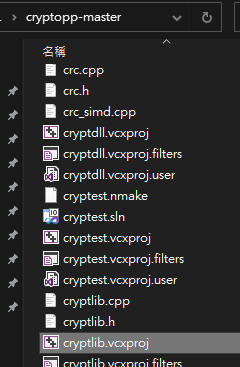
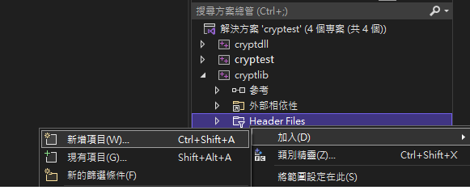
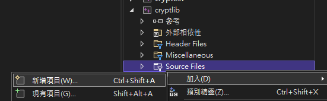
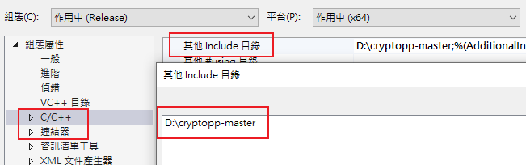
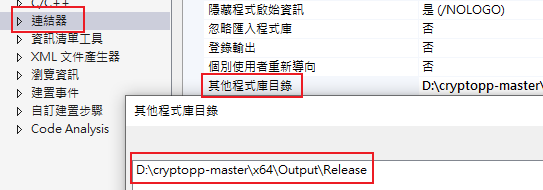
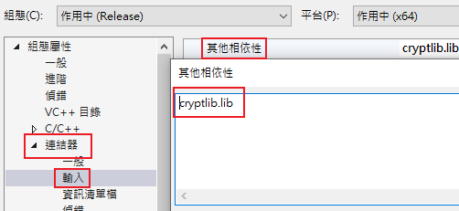

# Crypto++ in C/C++ on Windows
## Download
* [Visual Studio](https://visualstudio.microsoft.com/zh-hant/downloads/)
* [Crypto++](https://github.com/weidai11/cryptopp)
* [Crypto++ PEM](https://github.com/noloader/cryptopp-pem)
  * Copy all the files in ```Crypto++ PEM``` to ```Crypto++``` (skip those files that already existed in Crypto++)
## Build Crypto++
1. Open cryptlib.vcxproj with visual studio<br>
    
2. Add ```pem.h``` and ```pem_common.h``` to the ```Header Files``` of the ```cryptlib``` project<br>
    
3. Add ```pem_common.cpp```, ```pem_read.cpp``` and ```pem_write.cpp``` to the ```Source Files``` of the ```cryptlib``` project<br>
    
4. Choose the preferred configuration, ```Release/Debug```, and platform, ```Win32/x64```, for the project, then right click on ```cryptlib``` project and select ```build```
   * Static link library
5. Choose the preferred configuration, ```Release/Debug```, and platform, ```Win32/x64```, for the project, then right click on ```cryptdll``` project and select ```build```
    * Dynamic link library
### Output directory structure
```
├─Win32
│  ├─cryptdll
│  │  ├─Debug
│  │  │  └─cryptdll.tlog
│  │  └─Release
│  │      └─cryptdll.tlog
│  ├─cryptest
│  │  └─Debug
│  │      └─cryptest.tlog
│  ├─cryptlib
│  │  ├─Debug
│  │  │  └─cryptlib.tlog
│  │  └─Release
│  │      └─cryptlib.tlog
│  ├─DLL_Output
│  │  ├─Debug
│  │  └─Release
│  └─Output
│      ├─Debug
│      └─Release
└─x64
    ├─cryptdll
    │  ├─Debug
    │  │  └─cryptdll.tlog
    │  └─Release
    │      └─cryptdll.tlog
    ├─cryptlib
    │  ├─Debug
    │  │  └─cryptlib.tlog
    │  └─Release
    │      └─cryptlib.tlog
    ├─DLL_Output
    │  ├─Debug
    │  └─Release
    └─Output
        ├─Debug
        └─Release
```

## Include Crypto++ libraries in Visual Studio (statically)
### Project configure

* ```[專案] -> [屬性] -> [C/C++] -> [一般] -> [其他Include目錄] -> [Add path to the openssl folder which contains all Crypto++ header files]```


* ```[專案] -> [屬性] -> [連結器] -> [其他程式庫目錄] -> [Add path to folder that contains cryptlib.lib according to Debug/Release and Win32/x64]```


* ```[專案] -> [屬性] -> [連結器] -> [輸入] -> [其他相依性] -> [Add cryptlib.lib]```

### Headers
```cpp
// Common header files
#include <cryptlib.h>
#include <osrng.h>
#include <modes.h>
```

### Weak namespace
> Schemes and algorithms are moved into Weak when their security level is reduced to an unacceptable level by contemporary standards
* ARC4
* ARC4_Base
* MARC4
* MARC4_Base
* MD2
* MD4
* MD5
* PanamaHash
* PanamaMAC
* RSASSA_PKCS1v15_MD2_Signer
* RSASSA_PKCS1v15_MD2_Verifier
* RSASSA_PKCS1v15_MD5_Signer
* RSASSA_PKCS1v15_MD5_Verifier

You must add ```#define CRYPTOPP_ENABLE_NAMESPACE_WEAK 1``` before including a header for a weak or wounded algorithm

```cpp
// Example to use arc4
#define CRYPTOPP_ENABLE_NAMESPACE_WEAK 1
#include <arc4.h>
```

## Example
I've included some common cryptography algorithm examples using cryptopp libraries' high level API. Moreover, I've included the usage of ```RSA``` as an example of asymmetric cipher.

## References
* [RazviOverflow - Compiling Crypto++ in Microsoft Visual Studio 2019/2017 (with Cryptopp-PEM)](https://www.youtube.com/watch?v=5XE4zEN-WKg)
* [Crypto++ Library API Reference](https://cryptopp.com/docs/ref/index.html)
* [Crypto++ PEM Pack](https://www.cryptopp.com/wiki/PEM_Pack)
* [Crypto++ Visual Studio](https://www.cryptopp.com/wiki/Visual_Studio)
* [Crypto++ wiki](https://www.cryptopp.com/wiki/Main_Page)
* [Crypto++ Modes of Operation](https://www.cryptopp.com/wiki/Modes_of_Operation)